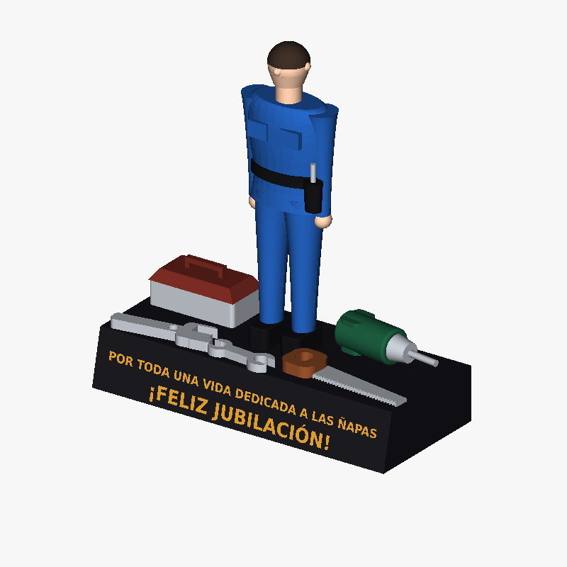

# Trofeo "¡Feliz jubilación!" — modelo 3D paramétrico

Reconstrucción CAD de la figura conmemorativa de la fotografía de referencia
(operario con mono azul sobre peana negra rotulada, con caja de herramientas,
llave inglesa, llave fija, serrucho y taladro).



## Ficheros

| Fichero | Uso |
|---|---|
| `trofeo_jubilacion.step` | **Para SolidWorks.** STEP AP214 con colores, 16 cuerpos nombrados. |
| `trofeo_jubilacion.stl`  | Malla para impresión 3D o visor rápido. |
| `trofeo_jubilacion.svg`  | Vista previa vectorial. |
| `trofeo_jubilacion.py`   | Código fuente paramétrico (CadQuery / OCCT). |
| `preview_frontal.png`, `preview_iso.png` | Renders de comprobación. |

Dimensiones totales: **200 × 86 × 221 mm** (peana 200 × 86 × 35).

## Abrir en SolidWorks

1. `Archivo > Abrir` → tipo **STEP AP203/214/242 (*.step; *.stp)** → `trofeo_jubilacion.step`.
2. En *Opciones*, marca **Importar múltiples cuerpos como piezas** si lo quieres
   como ensamblaje; déjalo sin marcar para obtener una **pieza multicuerpo**.
3. Deja activado *Ejecutar Diagnóstico de importación* y acepta la reparación si
   la propone (geometría de sólidos, no de superficies).
4. El árbol queda con los cuerpos: `peana`, `rotulo`, `mono_trabajo`,
   `cabeza_y_manos`, `pelo`, `botas_cinturon`, `caja_cuerpo`, `caja_tapa`,
   `llave_inglesa`, `llave_fija`, `serrucho_hoja`, `serrucho_mango`,
   `taladro_cuerpo`, `taladro_porta`, `taladro_broca`, `destornillador`.

El rótulo está resuelto como **vaciado de 0,8 mm en la peana + cuerpo de texto
independiente** que rellena exactamente ese vaciado: puedes suprimir el cuerpo
`rotulo` y quedarte con el grabado, o darle otro material/color.

## Modificar el modelo

El STEP es geometría muerta (sin árbol de operaciones). Para cambiar cotas,
texto o proporciones, edita el bloque `PARAMETROS` de `trofeo_jubilacion.py` y
regenera:

```bash
pip install cadquery
python trofeo_jubilacion.py
```

Parámetros más útiles: `BASE_L`, `BASE_W`, `BASE_H`, `BASE_SLOPE`, `TEXT_DEPTH`,
`LINEA_1`, `LINEA_2`, `H_LINEA_1`, `H_LINEA_2`, `FONT` (usa `"Arial"` en Windows),
`FIG_Y` y los colores `C_*`.

## Alcance y limitaciones

- Es una **reconstrucción estilizada**, no un escaneo: a partir de una sola foto
  no existe información métrica ni de las caras ocultas. Las cotas son una
  interpretación coherente, no las del objeto real.
- La cabeza **no es un retrato**. Si buscas parecido facial real, la vía es
  fotogrametría (30-60 fotos alrededor de la pieza) o un generador
  image-to-3D, y después importar esa malla como cuerpo gráfico.
- La figura y las herramientas son sólidos B-rep válidos (booleanas resueltas),
  aptos para impresión 3D. Los cuerpos se tocan pero no se interfieren.
